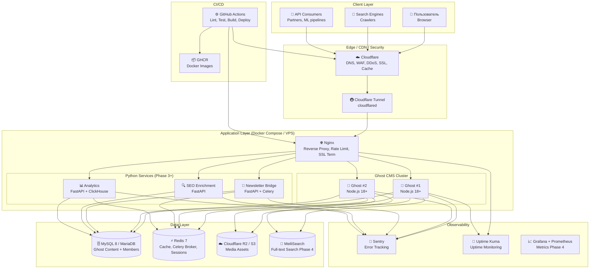
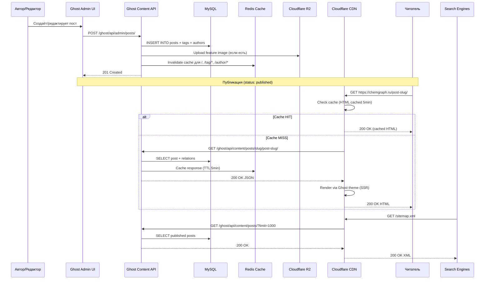
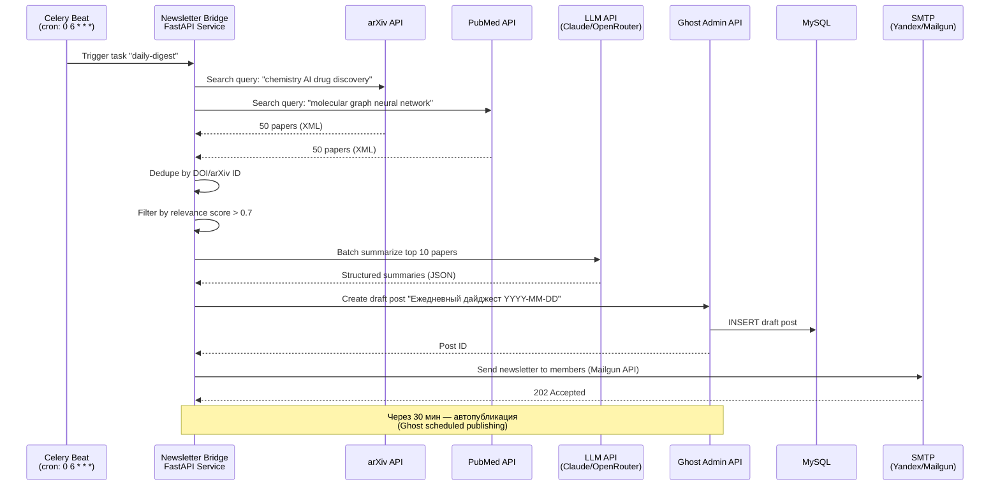
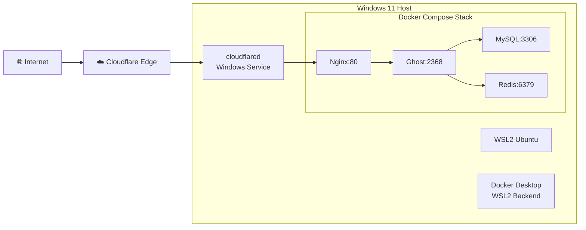
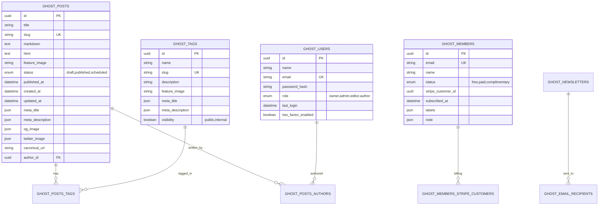
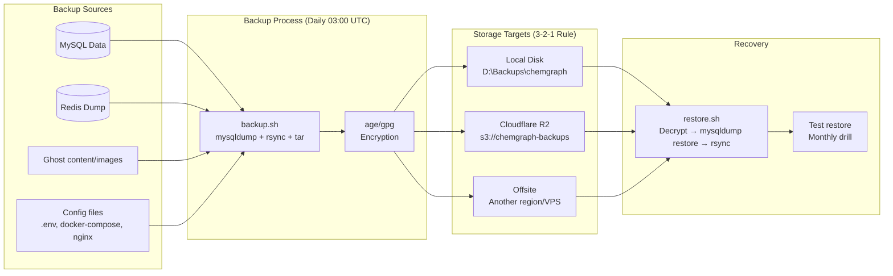

# Архитектура Chemgraph

> **Статус:** Документ живой — обновляется при каждом архитектурном решении (ADR).
> **Формат:** Context → Decision → Consequences (ADR-style).

---

## 1. Контекст (Context)

Chemgraph — контентная платформа с требованиями:
- **Высокая доступность контента** — статьи должны открываться быстро, без зависимостей от внешних API
- **Безопасность** — защита от DDoS, инъекций, утечки данных подписчиков
- **Масштабируемость** — от локального alpha-теста до продакшн нагрузки (10k+ MAU)
- **Observability** — понимание здоровья системы без ручного логирования
- **Cost-efficiency** — старт на бесплатных/дешёвых ресурсах, плавное масштабирование

---

## 2. Общая диаграмма компонентов (Component Diagram)



---

## 3. Data Flow (Sequence Diagram: Публикация статьи)



---

## 4. Data Flow (Sequence Diagram: Newsletter Bridge — Парсинг arXiv)



---

## 5. Deployment Architecture (Alpha vs Production)

### Alpha (Локально на Windows 11 + Cloudflare Tunnel)



**Характеристики Alpha:**
- Single-instance Ghost (нет HA)
- SQLite не поддерживается Ghost — обязателен MySQL даже в dev
- Cloudflare Tunnel даёт бесплатный HTTPS, DDoS защиту, скрывает домашний IP
- Бэкапы ручные (`make backup`) на локальный диск / сетевую папку

### Production (VPS + GitHub Actions Deploy)

```mermaid
graph TB
    subgraph "GitHub"
        REPO[📦 Private Repo<br/>chemgraph]
        ACTIONS[⚙️ GitHub Actions<br/>CI/CD Pipeline]
        GHCR[📦 GHCR<br/>ghcr.io/org/chemgraph/*]
    end
    
    subgraph "Cloudflare"
        CF_DNS[🌐 DNS: chemgraph.ru]
        CF_WAF[🛡️ WAF Rules]
        CF_R2[☁️ R2 Bucket<br/>media.chemgraph.ru]
    end
    
    subgraph "VPS (Selectel/Timeweb/Yandex Cloud)"
        subgraph "Docker Swarm / Compose"
            NGINX_P[Nginx:80/443<br/>SSL: Let's Encrypt/CF Origin Cert]
            
            subgraph "Ghost Cluster (2+ replicas)"
                GHOST_P1[Ghost #1]
                GHOST_P2[Ghost #2]
            end
            
            MYSQL_P[(MySQL 8<br/>Primary + Replica)]
            REDIS_P[(Redis Cluster<br/>Sentinel)]
            MEILI_P[MeiliSearch]
        end
        
        BACKUP_SRV[🗄️ Backup Server<br/>rsync + BorgBackup]
        MONITOR[📊 Uptime Kuma + Grafana]
    end
    
    REPO --> ACTIONS
    ACTIONS -->|Build & Push| GHCR
    ACTIONS -->|Deploy (SSH)| VPS
    ACTIONS -->|Purge Cache| CF
    
    USER[👤 Пользователь] --> CF_DNS
    CF_DNS --> CF_WAF
    CF_WAF --> NGINX_P
    NGINX_P --> GHOST_P1
    NGINX_P --> GHOST_P2
    GHOST_P1 --> MYSQL_P
    GHOST_P2 --> MYSQL_P
    GHOST_P1 --> REDIS_P
    GHOST_P2 --> REDIS_P
    GHOST_P1 --> CF_R2
    GHOST_P2 --> CF_R2
    GHOST_P1 --> MEILI_P
    GHOST_P2 --> MEILI_P
    
    MYSQL_P --> BACKUP_SRV
    CF_R2 --> BACKUP_SRV
    NGINX_P --> MONITOR
    GHOST_P1 --> MONITOR
```

---

## 6. Security Architecture (Threat Model)

```mermaid
graph TD
    subgraph "Threats"
        T1[DDoS Volumetric]
        T2[DDoS Application Layer]
        T3[SQL Injection]
        T4[XSS / CSRF]
        T5[Credential Stuffing]
        T6[Data Exfiltration]
        T7[Supply Chain Attack]
        T8[Secret Leakage]
    end
    
    subgraph "Mitigations"
        M1[Cloudflare WAF + Rate Limiting<br/>"Under Attack" mode]
        M2[Cloudflare Bot Fight Mode<br/>Turnstile on forms]
        M3[Parameterized Queries (Ghost ORM)<br/>No raw SQL in services]
        M4[CSP Headers (Nginx + Ghost)<br/>Subresource Integrity]
        M5[bcrypt + Rate Limit Login<br/>2FA for Admin/Members]
        M6[Encryption at Rest (MySQL TDE)<br/>Encryption in Transit (TLS 1.3)]
        M7[Dependabot + SCA (GitHub Actions)<br/>Signed images (cosign)]
        M8[.env + Docker Secrets<br/>No secrets in git/images]
    end
    
    T1 --> M1
    T2 --> M1
    T2 --> M2
    T3 --> M3
    T4 --> M4
    T5 --> M5
    T6 --> M6
    T7 --> M7
    T8 --> M8
```

---

## 7. Key Architectural Decisions (ADR Log)

### ADR-001: Ghost CMS как ядро платформы
- **Context:** Нужен профессиональный CMS с встроенными: memberships, newsletters, SEO, themes, API.
- **Decision:** Ghost (self-hosted) вместо WordPress/Strapi/Contentful.
- **Consequences:** 
  - ✅ Встроенные memberships, email newsletters, Stripe интеграция
  - ✅ Content API + Admin API для headless режима
  - ✅ Активное сообщество, регулярные релизы
  - ❌ Требует MySQL (не SQLite в продакшене)
  - ❌ Node.js стек — нужен отдельный Python для ML

### ADR-002: Cloudflare Tunnel для Alpha вместо VPS
- **Context:** Нужен публичный HTTPS для тестов без покупки VPS и настройки SSL.
- **Decision:** Cloudflare Tunnel (cloudflared) на Windows 11 хосте.
- **Consequences:**
  - ✅ Бесплатный HTTPS, DDoS защита, скрыт реальный IP
  - ✅ Работает за NAT/CGNAT, не нужен публичный IP
  - ❌ Зависимость от Cloudflare (vendor lock-in на уровне edge)
  - ❌ Cold start ~1-2 сек после простоя туннеля

### ADR-003: Docker Compose для локальной разработки
- **Context:** Нужен воспроизводимый стек: Ghost + MySQL + Redis + Nginx.
- **Decision:** docker-compose.yml с именованными volumes, healthchecks.
- **Consequences:**
  - ✅ `make dev` поднимает всё за 1 команду
  - ✅ Изоляция от хостовой ОС (WSL2)
  - ✅ Легкая миграция на VPS (тот же compose)
  - ❌ Windows filesystem performance для bind mounts (используем volumes)

### ADR-004: Python микросервисы отдельно от Ghost
- **Context:** ML/парсинг/аналитика не вписываются в Node.js архитектуру Ghost.
- **Decision:** Отдельные FastAPI сервисы, общающиеся с Ghost через Admin/Content API + прямая запись в MySQL (read-only replicas).
- **Consequences:**
  - ✅ Независимый деплой, скейлинг, стек
  - ✅ Python экосистема для ML (PyTorch, transformers, RDKit)
  - ❌ Сложнее транзакционность (eventual consistency)
  - ❌ Дублирование некоторых моделей (DRY через shared lib)

### ADR-005: Cloudflare R2 для медиа в продакшене
- **Context:** Ghost хранит изображения локально — не масштабируется, нет CDN.
- **Decision:** Ghost storage adapter → Cloudflare R2 (S3-compatible, 10GB free).
- **Consequences:**
  - ✅ Бесплатный egress, глобальный CDN через Cloudflare
  - ✅ S3 API — стандарт, легко мигрировать на S3/MinIO
  - ❌ Ghost не имеет нативного R2 адаптера — нужен кастомный или прокси

---

## 8. Network Ports & Connectivity

| Service | Internal Port | External (Alpha) | External (Prod) | Notes |
|---------|---------------|------------------|-----------------|-------|
| Nginx (HTTP) | 80 | localhost:80 | 80 (redirect→443) | Rate limiting, SSL termination |
| Nginx (HTTPS) | 443 | — | 443 | TLS 1.3, HSTS |
| Ghost | 2368 | localhost:2368 | Internal only | Binding 127.0.0.1 в prod |
| MySQL | 3306 | localhost:3306 | Internal only | Binding 127.0.0.1, SSL required |
| Redis | 6379 | localhost:6379 | Internal only | Binding 127.0.0.1, AUTH required |
| cloudflared | — | Windows Service | — | Outbound only, no inbound ports |
| MeiliSearch | 7700 | — | Internal only | Phase 4, master key required |
| Uptime Kuma | 3001 | — | VPN/SSH tunnel | Internal monitoring |
| Grafana | 3000 | — | VPN/SSH tunnel | Phase 4 |

---

## 9. Data Models (High-Level ERD)



---

## 10. Backup & Recovery Strategy



**RPO:** 24 часа (дневной бэкап)  
**RTO:** < 2 часа (автоматизированный restore скрипт)  
**Retention:** Daily × 7, Weekly × 4, Monthly × 12

---

## 11. Scaling Triggers (When to Scale)

| Metric | Threshold | Action |
|--------|-----------|--------|
| Ghost CPU > 70% 5min | Horizontal: add Ghost replica |
| MySQL connections > 80% max | Vertical: larger instance / read replica |
| Redis memory > 80% | Vertical: more RAM / Redis Cluster |
| Nginx 5xx > 1%/5min | Alert → investigate → scale Ghost |
| Disk usage > 80% | Cleanup / expand volume / move media to R2 |
| Tunnel latency p99 > 2s | Check cloudflared health / upgrade plan |

---

## 12. Appendices

### A. Useful Commands

```bash
# Проверить здоровье стека
docker-compose ps
docker-compose exec ghost ghost doctor

# Логи Ghost
docker-compose logs -f ghost | jq -R 'fromjson? | select(.level=="error")'

# MySQL инспекция
docker-compose exec mysql mysql -u ghost -p ghost -e "SHOW TABLE STATUS;"

# Redis инспекция
docker-compose exec redis redis-cli INFO memory

# Бэкап вручную
make backup

# Обновление Ghost версии
# 1. Обновить GHOST_VERSION в .env
# 2. make dev (rebuild)
# 3. ghost doctor в контейнере
```

### B. Links

- [Ghost Architecture](https://ghost.org/docs/architecture/)
- [Cloudflare Tunnel Docs](https://developers.cloudflare.com/cloudflare-one/connections/connect-networks/)
- [Docker Compose Spec](https://docs.docker.com/compose/compose-file/)
- [MySQL 8 Reference](https://dev.mysql.com/doc/refman/8.0/en/)