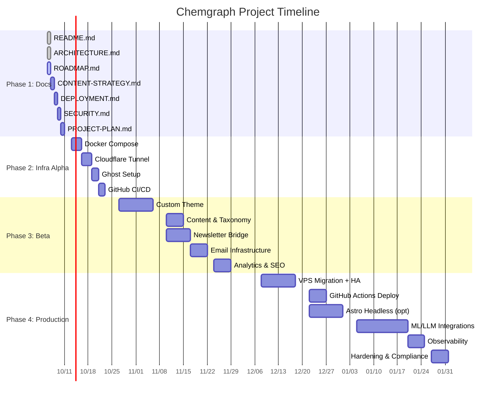

# Roadmap: Chemgraph — Alpha → Beta → Production

> **Версия:** 1.0  
> **Статус:** 🟡 Фаза 1 — Документирование  
> **Обновлено:** 2026-10-06

---

## Обзор фаз

| Фаза | Название | Длительность | Цель | Ключевой Deliverable |
|------|----------|--------------|------|---------------------|
| **1** | **Documentation & Planning** | 1 неделя | Полный набор docs, WBS, архитектура | `README.md`, `docs/*`, `PROJECT-PLAN.md` |
| **2** | **Infrastructure Alpha** | 2 недели | Локальный Ghost + Tunnel + CI/CD | Работающий `https://chemgraph.ru` через Tunnel |
| **3** | **Content & Features Beta** | 4-6 недель | Контент, тема, Python сервисы, Email | Публикуемый контент, дайджесты, подписка |
| **4** | **Production & Scale** | 4-8 недель | VPS, HA, Headless, ML, Observability | Продакшн на VPS, автодеплой, масштабируемость |

---

## ФАЗА 1: Documentation & Planning (Текущая)

**Длительность:** 1 неделя (5 рабочих дней)  
**Начало:** 2026-10-06  
**Конец:** 2026-10-10

### Deliverables

| # | Документ | Описание | Оценка |
|---|----------|----------|--------|
| 1.1 | `README.md` | Overview, quick start, структура репо | 2ч |
| 1.2 | `docs/ARCHITECTURE.md` | Mermaid диаграммы, data flow, ADR log | 4ч |
| 1.3 | `docs/ROADMAP.md` | Этот документ — детальный план с milestones | 3ч |
| 1.4 | `docs/CONTENT-STRATEGY.md` | Таксономия тегов, типы контента, editorial policy | 4ч |
| 1.5 | `docs/DEPLOYMENT.md` | Пошаговые инструкции: local, staging, prod | 4ч |
| 1.6 | `docs/SECURITY.md` | Threat model, secrets management, backup strategy | 3ч |
| 1.7 | `PROJECT-PLAN.md` | WBS на 4 недели с оценками времени | 2ч |

### Milestones

- [ ] **M1.1** — Все 7 документов созданы и ревьюнуты
- [ ] **M1.2** — Архитектура утверждена (нет блокеров для Фазы 2)
- [ ] **M1.3** — WBS детализирован до задач по 2-4 часа

### Exit Criteria (Definition of Done)

- [ ] Все документы в `docs/` и корне репо
- [ ] Mermaid диаграммы рендерятся на GitHub
- [ ] Нет неразрешённых вопросов в ADR log
- [ ] Пользователь подтвердил переход к Фазе 2

---

## ФАЗА 2: Infrastructure Alpha (Local + Tunnel)

**Длительность:** 2 недели (10 рабочих дней)  
**Планируемый старт:** 2026-10-13  
**Планируемый конец:** 2026-10-24

### Цель
Работающий Ghost CMS, доступный публично по `https://chemgraph.ru` через Cloudflare Tunnel, с CI/CD пайплайном.

### Work Packages

#### WP2.1: Docker Configuration (3 дня)

| Задача | Описание | Оценка |
|--------|----------|--------|
| 2.1.1 | `docker-compose.yml` — Ghost, MySQL 8, Redis 7, Nginx | 4ч |
| 2.1.2 | `Dockerfile.ghost` — multi-stage, non-root, healthcheck | 3ч |
| 2.1.3 | `.dockerignore`, `.env.example` | 1ч |
| 2.1.4 | `config/nginx.conf` — reverse proxy, rate limit, CSP headers | 3ч |
| 2.1.5 | `config/ghost/config.production.json` — Ghost production config | 2ч |
| 2.1.6 | `Makefile` — dev, down, logs, shell-*, backup, restore, clean, lint | 4ч |
| 2.1.7 | Тестовый запуск `make dev` → Ghost на localhost:2368 | 2ч |

#### WP2.2: Cloudflare Tunnel Setup (Windows 11) (3 дня)

| Задача | Описание | Оценка |
|--------|----------|--------|
| 2.2.1 | `scripts/setup-tunnel.ps1` — установка cloudflared через winget | 3ч |
| 2.2.2 | Авторизация `cloudflared tunnel login` | 1ч |
| 2.2.3 | Создание туннеля `cloudflared tunnel create chemgraph` | 1ч |
| 2.2.4 | Настройка DNS CNAME `chemgraph.ru` → `<tunnel-id>.cfargotunnel.com` | 1ч |
| 2.2.5 | `config/cloudflared.yml` — ingress rules (HTTP → localhost:80) | 2ч |
| 2.2.6 | Установка как Windows Service (`cloudflared service install`) | 2ч |
| 2.2.7 | Тест: `https://chemgraph.ru` открывается, SSL валиден | 2ч |

#### WP2.3: Ghost Initial Setup (2 дня)

| Задача | Описание | Оценка |
|--------|----------|--------|
| 2.3.1 | Первый вход в `/ghost` — создание Owner аккаунта | 0.5ч |
| 2.3.2 | Settings → General: Publication URL = `https://chemgraph.ru` | 0.5ч |
| 2.3.3 | Settings → Email: SMTP конфигурация (Yandex/Mailgun) | 2ч |
| 2.3.4 | Settings → Members: порталы, tiers (free/paid) | 2ч |
| 2.3.5 | Settings → Design: загрузка базовой темы (Source/Liebling fork) | 2ч |
| 2.3.6 | Проверка: sitemap.xml, robots.txt, RSS, JSON-LD | 1ч |

#### WP2.4: GitHub Repository & CI/CD (2 дня)

| Задача | Описание | Оценка |
|--------|----------|--------|
| 2.4.1 | Создание private repo `chemgraph` на GitHub | 0.5ч |
| 2.4.2 | `.gitignore` (Ghost, Node, Python, .env, secrets) | 1ч |
| 2.4.3 | Branch strategy: `main`, `develop`, feature/* | 0.5ч |
| 2.4.4 | GitHub Actions: `.github/workflows/ci.yml` — lint, test, build | 3ч |
| 2.4.5 | GitHub Actions: `.github/workflows/deploy.yml` — build & push to GHCR | 2ч |
| 2.4.6 | GitHub Environments: `production` с manual approval | 1ч |
| 2.4.7 | Dependabot + CodeQL scanning | 1ч |

### Milestones

- [ ] **M2.1** — `make dev` поднимает стек без ошибок (WP2.1)
- [ ] **M2.2** — `https://chemgraph.ru` отвечает 200 OK, SSL A+ (WP2.2)
- [ ] **M2.3** — Ghost настроен, тестовый пост публикуется (WP2.3)
- [ ] **M2.4** — CI проходит на PR, образ в GHCR (WP2.4)

### Exit Criteria

- [ ] Сайт доступен по `https://chemgraph.ru` 24/7 (пока туннель запущен)
- [ ] Ghost Admin работает, контент создаётся/публикуется
- [ ] Email отправляется (тестовый newsletter)
- [ ] CI/CD пайплайн зелёный на `main`
- [ ] Бэкап/восстановление протестированы (`make backup && make restore`)

---

## ФАЗА 3: Content & Features Beta

**Длительность:** 4-6 недель (20-30 рабочих дней)  
**Планируемый старт:** 2026-10-27  
**Планируемый конец:** 2026-12-05

### Цель
Наполненный контентом портал с кастомной темой, автоматическими дайджестами, рабочей подпиской и базовой аналитикой.

### Work Packages

#### WP3.1: Custom Ghost Theme (2 недели)

| Задача | Описание | Оценка |
|--------|----------|--------|
| 3.1.1 | Fork темы `Source` → `themes/chemgraph-theme` | 2ч |
| 3.1.2 | Дизайн-система: цвета, типографика, spacing (CSS custom props) | 4ч |
| 3.1.3 | Компоненты: Hero, PostCard, TagHub, NewsletterForm, TOC | 8ч |
| 3.1.4 | Hub-страницы: `/ai-in-chemistry`, `/pharma-ai`, `/drug-discovery` | 6ч |
| 3.1.5 | SEO: JSON-LD (Article, BreadcrumbList, Organization), meta tags | 4ч |
| 3.1.6 | Доступность (a11y): ARIA, семантика, контраст, focus states | 4ч |
| 3.1.7 | Респонсив: mobile-first, dark mode (prefers-color-scheme) | 4ч |
| 3.1.8 | Интеграция с Ghost: routes.yaml, custom helpers, partials | 4ч |

#### WP3.2: Content Taxonomy & Editorial Policy (1 неделя)

| Задача | Описание | Оценка |
|--------|----------|--------|
| 3.2.1 | Финальная таксономия тегов (primary + secondary) | 3ч |
| 3.2.2 | `docs/CONTENT-STRATEGY.md` — завершение | 4ч |
| 3.2.3 | Создание 10+ pillar-статей (evergreen контент) | 20ч |
| 3.2.4 | Настройка Ghost: tag descriptions, feature images, meta | 3ч |
| 3.2.5 | Editorial calendar: план публикаций на 3 месяца | 2ч |

#### WP3.3: Python Services — Newsletter Bridge (1.5 недели)

| Задача | Описание | Оценка |
|--------|----------|--------|
| 3.3.1 | `services/newsletter-bridge/` — FastAPI проект структура | 2ч |
| 3.3.2 | Парсеры: arXiv API, PubMed API, ChemRxiv RSS, FDA RSS, EMA RSS | 8ч |
| 3.3.3 | Дедедупликация по DOI/arXiv ID, relevance scoring | 4ч |
| 3.3.4 | LLM суммаризация (Claude API / OpenRouter) — батчевая | 6ч |
| 3.3.5 | Создание Ghost draft через Admin API | 3ч |
| 3.3.6 | Celery Beat расписание: ежедневно 06:00 UTC | 2ч |
| 3.3.7 | Dockerfile + docker-compose расширение | 2ч |
| 3.3.8 | Тесты: unit (pytest), integration (Testcontainers) | 4ч |

#### WP3.4: Email Infrastructure (1 неделя)

| Задача | Описание | Оценка |
|--------|----------|--------|
| 3.4.1 | Yandex Mail for Domain / Mailgun / Brevo — выбор и настройка | 3ч |
| 3.4.2 | SPF, DKIM, DMARC записи в Cloudflare DNS | 2ч |
| 3.4.3 | Bounce handling, suppression list (Mailgun webhooks) | 3ч |
| 3.4.4 | Сегментация: free vs paid members, теги интересов | 2ч |
| 3.4.5 | Шаблоны писем: welcome, digest, new post, churn | 4ч |
| 3.4.6 | Тестовая рассылка к сегменту | 1ч |

#### WP3.5: Analytics & SEO Enrichment (1 неделя)

| Задача | Описание | Оценка |
|--------|----------|--------|
| 3.5.1 | `services/analytics/` — Umami/Plausible self-hosted (Docker) | 3ч |
| 3.5.2 | Интеграция трекера в Ghost theme (head script) | 1ч |
| 3.5.3 | `services/seo-enrichment/` — генерация meta, schema.org из контента | 4ч |
| 3.5.4 | Sitemap ping (Google, Yandex, Bing) при публикации | 2ч |
| 3.5.5 | Core Web Vitals monitoring (web-vitals library) | 2ч |

### Milestones

- [ ] **M3.1** — Кастомная тема на проде, Lighthouse > 90 (WP3.1)
- [ ] **M3.2** — 10+ pillar статей опубликовано, таксономия в Ghost (WP3.2)
- [ ] **M3.3** — Ежедневный дайджест создаётся автоматически (WP3.3)
- [ ] **M3.4** — Email доставляется, открытия > 20%, unsubscribe работает (WP3.4)
- [ ] **M3.5** — Аналитика собирается, SEO score > 80 (WP3.5)

### Exit Criteria

- [ ] Контентный план выполняется (3+ статьи/неделю)
- [ ] Автоматические дайджесты уходят ежедневно без ручного вмешательства
- [ ] Подписка работает: free → paid апгрейд через Stripe (test mode)
- [ ] Core Web Vitals: LCP < 2.5s, CLS < 0.1, FID < 100ms

---

## ФАЗА 4: Production & Scale

**Длительность:** 4-8 недель (20-40 рабочих дней)  
**Планируемый старт:** 2026-12-08  
**Планируемый конец:** 2027-01-30

### Цель
Продакшн-готовая инфраструктура на VPS с HA, автодеплоем, headless фронтендом (опционально), ML поиском и полной наблюдаемостью.

### Work Packages

#### WP4.1: VPS Migration & HA (2 недели)

| Задача | Описание | Оценка |
|--------|----------|--------|
| 4.1.1 | Выбор VPS провайдера (Selectel/Timeweb/Yandex Cloud) — 152-ФЗ | 2ч |
| 4.1.2 | Provisioning: Terraform/Ansible для VPS (Ubuntu 22.04, Docker, Swarm) | 8ч |
| 4.1.3 | MySQL Primary + Replica (GTID replication) | 4ч |
| 4.1.4 | Redis Sentinel / Cluster для HA | 4ч |
| 4.1.5 | Nginx + Let's Encrypt / Cloudflare Origin Certificates | 3ч |
| 4.1.6 | Ghost 2+ replicas за Nginx (sticky sessions для admin) | 4ч |
| 4.1.7 | Миграция данных: `make backup` → restore на VPS | 3ч |
| 4.1.8 | Переключение DNS: `chemgraph.ru` → VPS IP (или оставить Tunnel) | 1ч |

#### WP4.2: GitHub Actions Production Deploy (1 неделя)

| Задача | Описание | Оценка |
|--------|----------|--------|
| 4.2.1 | `.github/workflows/prod-deploy.yml` — rolling update на VPS | 4ч |
| 4.2.2 | SSH deploy key + known_hosts в GitHub Secrets | 1ч |
| 4.2.3 | Pre-deploy проверки: migrate, healthcheck, smoke tests | 3ч |
| 4.2.4 | Rollback стратегия (previous image tag) | 2ч |
| 4.2.5 | Slack/Telegram уведомления о деплое | 1ч |

#### WP4.3: Headless Frontend — Astro (Опционально, 2 недели)

| Задача | Описание | Оценка |
|--------|----------|--------|
| 4.3.1 | `frontend/astro-chemgraph/` — Astro 4 + React islands | 4ч |
| 4.3.2 | Ghost Content API интеграция (GraphQL/REST) | 4ч |
| 4.3.3 | ISR: `getStaticPaths` + `revalidate` для статей | 4ч |
| 4.3.4 | Деплой на Cloudflare Pages / Vercel | 2ч |
| 4.3.5 | Preview deployments для PR | 2ч |
| 4.3.6 | Синхронизация темы: общие компоненты (design tokens) | 4ч |

#### WP4.4: ML/LLM Integrations (2-3 недели)

| Задача | Описание | Оценка |
|--------|----------|--------|
| 4.4.1 | MeiliSearch / Typesense — полнотекстовый поиск по постам | 4ч |
| 4.4.2 | Embeddings pipeline: sentence-transformers (multilingual) | 6ч |
| 4.4.3 | Semantic search API: `/api/search?q=` → vector + keyword hybrid | 4ч |
| 4.4.4 | LLM-assisted дайджесты: RAG над своим контентом | 8ч |
| 4.4.5 | Related posts widget (embeddings similarity) | 3ч |
| 4.4.6 | Классификация статей по тегам (zero-shot / fine-tuned) | 4ч |

#### WP4.5: Observability & Monitoring (1 неделя)

| Задача | Описание | Оценка |
|--------|----------|--------|
| 4.5.1 | Uptime Kuma — self-hosted (Docker) — uptime, SSL expiry, DNS | 2ч |
| 4.5.2 | Sentry — Ghost (Node) + Python services (DSN в .env) | 2ч |
| 4.5.3 | Grafana + Prometheus — node-exporter, cadvisor, mysqld-exporter | 4ч |
| 4.5.4 | Дашборды: Ghost health, MySQL, Redis, Nginx, Business metrics | 4ч |
| 4.5.5 | Alerting: Telegram/Email на критические метрики | 2ч |

#### WP4.6: Hardening & Compliance (1 неделя)

| Задача | Описание | Оценка |
|--------|----------|--------|
| 4.6.1 | Penetration test (базовый: OWASP ZAP, Nuclei) | 4ч |
| 4.6.2 | GDPR / 152-ФЗ: privacy policy, cookie consent, data export/delete | 4ч |
| 4.6.3 | Backup verification drill (monthly) | 2ч |
| 4.6.4 | Disaster recovery runbook | 3ч |
| 4.6.5 | Documentation sync: DEPLOYMENT.md, ARCHITECTURE.md актуальны | 2ч |

### Milestones

- [ ] **M4.1** — Продакшн на VPS, HA работает, RTO < 30 мин (WP4.1)
- [ ] **M4.2** — Деплой через GitHub Actions: `git push main` → prod (WP4.2)
- [ ] **M4.3** — Astro фронтенд на Cloudflare Pages, ISR работает (WP4.3)
- [ ] **M4.4** — Semantic search + LLM дайджесты в проде (WP4.4)
- [ ] **M4.5** — Полная наблюдаемость: алерты приходят, дашборды живые (WP4.5)
- [ ] **M4.6** — Security audit пройден, compliance документы готовы (WP4.6)

### Exit Criteria

- [ ] 99.9% uptime SLA (исключая плановое обслуживание)
- [ ] Автоматический деплой на main с ручным approval
- [ ] Поиск работает быстрее 200ms p99
- [ ] LLM дайджесты генерируются за < 60 сек
- [ ] Все секреты в Docker Secrets / 1Password / Vault
- [ ] Документация актуальна для onboarding нового инженера

---

## Сводная временная шкала (Gantt-подобная)

---

## Бюджетная оценка (Monthly Recurring Costs)

| Компонент | Alpha (Local) | Beta (Local + SaaS) | Production (VPS) |
|-----------|---------------|---------------------|------------------|
| VPS (2× CPU, 4GB RAM, 80GB SSD) | — | — | ~$15-25/мес (Selectel/Timeweb) |
| Domain `chemgraph.ru` | ~$10/год | ~$10/год | ~$10/год |
| Cloudflare (Free tier) | $0 | $0 | $0 (Pro $20 если нужно) |
| Cloudflare R2 (10GB free) | — | $0 | $0-5/мес |
| Email (Mailgun/Brevo free tier) | — | $0 (до 1k-3k/мес) | $10-35/мес |
| LLM API (OpenRouter/Claude) | — | $5-20/мес | $20-100/мес |
| Sentry (Free tier) | $0 | $0 | $0 (Team $26/мес) |
| Uptime Kuma (self-hosted) | $0 | $0 | $0 |
| **Итого в месяц** | **~$1** | **~$15-45** | **~$50-180** |

*Цены ориентировочные на 2026 год. Free tiers покрывают Alpha/Beta полностью.*

---

## Риски и митигация

| Риск | Вероятность | Влияние | Митигация |
|------|-------------|---------|-----------|
| Cloudflare Tunnel нестабилен (disconnects) | Средняя | Высокое | Мониторинг uptime, авторестарт systemd service, fallback на VPS |
| Ghost MySQL corruption / migration issues | Низкая | Критическое | Ежедневные бэкапы, тестовые restore, read replica |
| LLM API costs выходят за бюджет | Средняя | Среднее | Hard limits в коде, кэширование embeddings, локальные модели (Ollama) |
| Российские санкции / блокировки Cloudflare | Низкая | Критическое | Зарезервировать `chemgraph.ru` на русском регистраторе, план Б: Yandex Cloud + свой TLS |
| Некомплаенс 152-ФЗ (персональные данные) | Низкая | Критическое | VPS в РФ, privacy policy, data processing agreement, DPIA |
| Ghost breaking changes при обновлении | Средняя | Среднее | Pin версии в `.env`, staging среда, автотесты перед апгрейдом |

---

## Success Metrics (KPIs)

### Alpha (Фаза 2)
- [ ] Uptime > 99% (трекинг через Uptime Kuma)
- [ ] Ghost Admin доступен, 0 критических ошибок в логах
- [ ] SSL Labs Grade A+

### Beta (Фаза 3)
- [ ] 50+ опубликованных статей
- [ ] 100+ подписчиков (free tier)
- [ ] Email open rate > 25%, CTR > 3%
- [ ] Lighthouse Performance > 90, SEO > 90, Accessibility > 90

### Production (Фаза 4)
- [ ] 500+ подписчиков (free + paid)
- [ ] MRR > $100 (если монетизация)
- [ ] Organic traffic > 1k sessions/мес
- [ ] Search latency p99 < 200ms
- [ ] Zero critical security findings
- [ ] Deploy frequency > 1/week, lead time < 1 час

---

## Dependencies & Blockers

| ID | Dependency | Блокирует | Статус | Owner |
|----|------------|-----------|--------|-------|
| D1 | Домен `chemgraph.ru` зарегистрирован | Фаза 2 (Tunnel, DNS) | ⏳ Pending | User |
| D2 | Cloudflare аккаунт создан | Фаза 2 (Tunnel) | ⏳ Pending | User |
| D3 | SMTP провайдер выбран (Yandex/Mailgun/Brevo) | Фаза 2.3, 3.4 | ⏳ Pending | User |
| D4 | VPS провайдер выбран (Selectel/Timeweb/Yandex) | Фаза 4.1 | ⏳ Future | User |
| D5 | LLM API ключи (OpenRouter/Claude) | Фаза 3.3, 4.4 | ⏳ Future | User |
| D6 | Stripe аккаунт (для paid memberships) | Фаза 3.2, 4.6 | ⏳ Future | User |

---

## Next Actions (Immediate)

1. ✅ **README.md** — создан
2. ✅ **docs/ARCHITECTURE.md** — создан
3. 🔄 **docs/ROADMAP.md** — создаётся сейчас
4. ⏳ **docs/CONTENT-STRATEGY.md** — следующий
5. ⏳ **docs/DEPLOYMENT.md** — следующий
6. ⏳ **docs/SECURITY.md** — следующий
7. ⏳ **PROJECT-PLAN.md** — следующий (WBS детализация)

---

*После завершения всех 7 документов Фазы 1 — жду подтверждения пользователя для перехода к Фазе 2.*