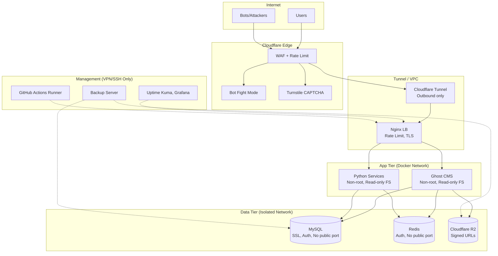
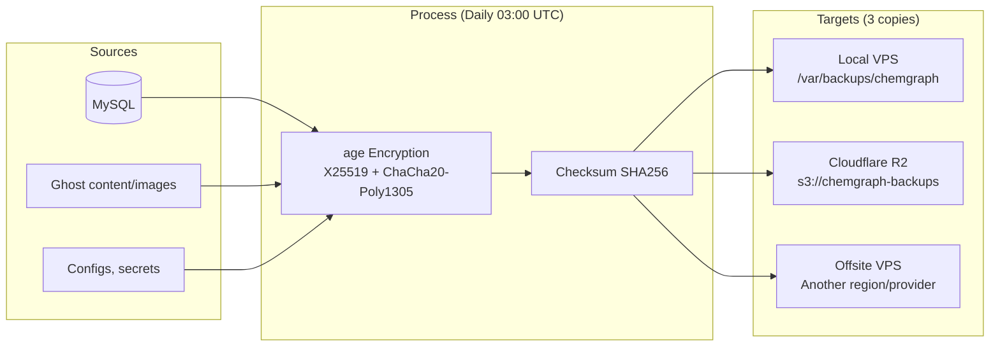
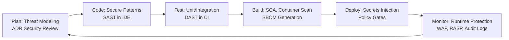

# Security Guide: Chemgraph

> **Версия:** 1.0  
> **Статус:** 🟡 Черновик — требует ревью безопасности  
> **Обновлено:** 2026-10-06  
> **Классификация:** Internal — не для публичного доступа

---

## 1. Threat Model (STRIDE)

### 1.1 Assets (Что защищаем)

| Asset | Классификация | Ценность | Регуляторные требования |
|-------|---------------|----------|------------------------|
| Контент статей (публичный) | Public | Бренд, SEO | — |
| Контент статей (дraft/private) | Confidential | IP, unpublished research | — |
| Пользовательские данные (email, имя) | PII | GDPR Art. 4, 152-ФЗ ст. 3 | GDPR, 152-ФЗ |
| Платёжные данные (Stripe) | Restricted | Financial | PCI DSS SAQ A (Stripe handles) |
| Учётные записи админов/авторов | Restricted | System control | — |
| API ключи (LLM, Email, Cloudflare) | Restricted | Cost, abuse, data access | — |
| Бэкапы БД и медиа | Confidential | Business continuity | 152-ФЗ (хранение в РФ) |
| Аналитика (IP, User Agent) | PII | Product metrics | GDPR, ePrivacy |

### 1.2 Threat Actors

| Actor | Motivation | Capability | Likelihood |
|-------|------------|------------|------------|
| Script kiddies / Automated bots | Defacement, spam, crypto mining | Low (automated tools) | High |
| Credential stuffers | Account takeover | Medium (breached DBs) | High |
| Competitors / Scrapers | Content theft, SEO harm | Medium (custom scrapers) | Medium |
| Disgruntled insider | Sabotage, data leak | High (legit access) | Low |
| APT / Targeted attacker | Espionage, supply chain | High (0-day, social eng) | Very Low |
| Cloudflare / VPS provider insider | Data access | High (infra access) | Low |

### 1.3 STRIDE Analysis

| Threat | Vectors | Impact | Likelihood | Mitigations |
|--------|---------|--------|------------|-------------|
| **Spoofing** | Fake admin login, phishing emails, forged webhooks | Account takeover, data manipulation | High | 2FA, WebAuthn, DMARC, signed webhooks |
| **Tampering** | SQLi, XSS, CSRF, malicious uploads, MITM | Data corruption, defacement, RCE | Medium | Parameterized queries, CSP, CSRF tokens, file validation, TLS 1.3 |
| **Repudiation** | Deleted audit logs, anonymous actions | Inability to investigate | Medium | Immutable audit logs (Sentry, Cloudflare), signed commits |
| **Info Disclosure** | Error messages, directory listing, backup exposure, Git leaks | PII leak, credential leak, IP theft | High | Error handling, no directory index, encrypted backups, git-secrets |
| **DoS** | Volumetric, application layer (Ghost admin, search), API abuse | Downtime, cost | High | Cloudflare WAF, rate limiting, CAPTCHA, auto-scaling |
| **Elevation of Privilege** | Container escape, kernel exploit, misconfigured RBAC | Full system compromise | Low | Non-root containers, read-only fs, seccomp, least privilege |

---

## 2. Security Architecture

### 2.1 Network Segmentation



### 2.2 Defense in Depth Layers

| Layer | Controls |
|-------|----------|
| **Perimeter** | Cloudflare WAF (OWASP Top 10 rules), Rate limiting (100 req/min/IP), Bot Fight Mode, Turnstile on forms, Geo-blocking (опционально) |
| **Network** | Cloudflare Tunnel (no inbound ports), Docker internal networks, Nginx rate limiting (10 req/s burst), mTLS между сервисами (Phase 4) |
| **Host** | Ubuntu 22.04 LTS (auto security updates), Docker containers non-root, read-only rootfs, no-new-privileges, seccomp profile, UFW deny all inbound except SSH (key-only) |
| **Application** | Ghost: CSP, HSTS, X-Frame-Options, Referrer-Policy; Python: Pydantic validation, SQLAlchemy ORM (no raw SQL), JWT RS256, bcrypt |
| **Data** | MySQL: SSL required, TLS 1.3, TDE (at rest), column-level encryption для PII; Redis: AUTH, TLS; R2: SSE-S3, bucket policies |
| **Identity** | Ghost: 2FA (TOTP), WebAuthn, session rotation; SSH: Ed25519 keys only, no password auth; GitHub: 2FA required, SSO (SAML/OIDC) |
| **Observability** | Sentry (error tracking, PII scrubbing), Uptime Kuma (synthetic checks), Audit logs (Ghost admin actions, SSH, Docker), Cloudflare logs (SIEM) |

---

## 3. Secrets Management

### 3.1 Classification & Handling

| Secret Type | Examples | Storage | Rotation | Access |
|-------------|----------|---------|----------|--------|
| **Infrastructure** | DB passwords, Redis password, JWT_SECRET | Docker Secrets (prod), .env (local only) | 90 days | Deploy pipeline only |
| **External API** | OpenRouter/Claude API, Mailgun/Brevo SMTP, Cloudflare API Token | 1Password / Vault / GitHub Environments Secrets | 90 days | CI/CD + Runtime (injected) |
| **SSL/TLS** | Origin Certs, Let's Encrypt keys | Docker Secrets / Certbot managed | Auto (LE: 90d, CF: 15y) | Nginx only |
| **Backup Encryption** | age/gpg keys | 1Password (shared vault) | Annual | Backup/Restore scripts only |
| **Stripe** | Secret key, Webhook signing secret | Stripe Dashboard → GitHub Env Secrets | Per Stripe policy | Payment service only |

### 3.2 Local Development (.env)

```bash
# .env.example — КОММИТТИТСЯ В ГИТ
# .env — НИКОГДА НЕ КОММИТТИТСЯ (.gitignore)

# Генерация секретов для dev:
# JWT_SECRET: openssl rand -base64 32
# MYSQL_ROOT_PASSWORD: openssl rand -base64 24
# REDIS_PASSWORD: openssl rand -base64 24
```

### 3.3 Production (Docker Secrets)

```bash
# Создание секретов на VPS (один раз)
echo "$MYSQL_ROOT_PASSWORD" | docker secret create mysql_root_password -
echo "$MYSQL_PASSWORD" | docker secret create mysql_password -
echo "$REDIS_PASSWORD" | docker secret create redis_password -
echo "$JWT_SECRET" | docker secret create jwt_secret -
echo "$SMTP_PASSWORD" | docker secret create smtp_password -
echo "$STRIPE_SECRET" | docker secret create stripe_secret -
echo "$STRIPE_WEBHOOK_SECRET" | docker secret create stripe_webhook_secret -

# В docker-compose.prod.yml:
secrets:
  mysql_root_password:
    external: true
  mysql_password:
    external: true
  # ...

services:
  ghost:
    secrets:
      - mysql_password
      - jwt_secret
      - smtp_password
    environment:
      MYSQL_PASSWORD_FILE: /run/secrets/mysql_password
      JWT_SECRET_FILE: /run/secrets/jwt_secret
```

### 3.4 CI/CD Secrets (GitHub Actions)

```yaml
# GitHub Repository → Settings → Secrets and variables → Actions
# Environments: production (requires approval)

# Required secrets:
GHCR_TOKEN              # packages:write (auto: ${{ secrets.GITHUB_TOKEN }})
CLOUDFLARE_API_TOKEN    # Zone:Read, DNS:Edit, Tunnel:Edit
CLOUDFLARE_ACCOUNT_ID   # For tunnel operations
SSH_PRIVATE_KEY         # Ed25519 для деплоя на VPS
SSH_KNOWN_HOSTS         # ssh-keyscan output
STRIPE_SECRET_KEY       # From Stripe Dashboard
STRIPE_WEBHOOK_SECRET   # From Stripe Dashboard
OPENROUTER_API_KEY      # For LLM services
MAILGUN_API_KEY         # For email
SENTRY_DSN              # For error tracking
AGE_PUBLIC_KEY          # For backup encryption
```

---

## 4. Application Security

### 4.1 Ghost CMS Hardening

```json
// config/ghost/config.production.json
{
  "url": "https://chemgraph.ru",
  "admin": {
    "url": "https://chemgraph.ru/ghost"
  },
  "database": {
    "client": "mysql",
    "connection": {
      "host": "mysql",
      "database": "ghost",
      "ssl": { "rejectUnauthorized": true }
    }
  },
  "mail": {
    "transport": "SMTP",
    "options": {
      "host": "smtp.mailgun.org",
      "port": 465,
      "secure": true,
      "auth": {
        "user": "postmaster@mg.chemgraph.ru",
        "pass": "{{SMTP_PASSWORD_FILE}}"
      }
    }
  },
  "security": {
    "frameOptions": "DENY",
    "referrerPolicy": "strict-origin-when-cross-origin",
    "contentSecurityPolicy": {
      "default-src": "'self'",
      "script-src": "'self' 'unsafe-inline' https://cdn.jsdelivr.net https://unpkg.com",
      "style-src": "'self' 'unsafe-inline' https://fonts.googleapis.com",
      "font-src": "'self' https://fonts.gstatic.com",
      "img-src": "'self' data: https:",
      "connect-src": "'self' https://api.chemgraph.ru",
      "frame-ancestors": "'none'",
      "form-action": "'self'",
      "base-uri": "'self'",
      "object-src": "'none'"
    },
    "hsts": {
      "maxAge": 31536000,
      "includeSubDomains": true,
      "preload": true
    }
  },
  "privacy": {
    "useUpdateCheck": false,
    "useGravatar": false,
    "useRpcPing": false
  }
}
```

### 4.2 Nginx Security Headers

```nginx
# config/nginx.conf (security section)

# Rate limiting
limit_req_zone $binary_remote_addr zone=api:10m rate=10r/s;
limit_req_zone $binary_remote_addr zone=login:10m rate=5r/m;
limit_req_zone $binary_remote_addr zone=search:10m rate=30r/m;

# Security headers (add_header always)
add_header X-Frame-Options "DENY" always;
add_header X-Content-Type-Options "nosniff" always;
add_header X-XSS-Protection "1; mode=block" always;
add_header Referrer-Policy "strict-origin-when-cross-origin" always;
add_header Permissions-Policy "geolocation=(), microphone=(), camera=()" always;
add_header Content-Security-Policy "default-src 'self'; script-src 'self' 'unsafe-inline' https://cdn.jsdelivr.net https://unpkg.com; style-src 'self' 'unsafe-inline' https://fonts.googleapis.com; font-src 'self' https://fonts.gstatic.com; img-src 'self' data: https:; connect-src 'self' https://api.chemgraph.ru; frame-ancestors 'none'; form-action 'self'; base-uri 'self'; object-src 'none';" always;

# HSTS (preload eligible)
add_header Strict-Transport-Security "max-age=31536000; includeSubDomains; preload" always;

# Hide version
server_tokens off;

# Block sensitive files
location ~ /\.(git|env|htaccess|htpasswd) { deny all; return 404; }
location ~* \.(sql|bak|backup|env)$ { deny all; return 404; }

# Rate limit login/admin
location /ghost/api/admin/members/login/ {
    limit_req zone=login burst=3 nodelay;
    proxy_pass http://ghost;
}
location /ghost/ {
    limit_req zone=api burst=20 nodelay;
    proxy_pass http://ghost;
}
```

### 4.3 Python Services Security

```python
# services/*/security.py
from fastapi import Security, HTTPException, Depends
from fastapi.security import APIKeyHeader
from pydantic import BaseModel, Field
import jwt
import os

API_KEY_HEADER = APIKeyHeader(name="X-API-Key", auto_error=False)

class TokenPayload(BaseModel):
    sub: str
    scopes: list[str] = Field(default_factory=list)
    exp: int

async def verify_api_key(api_key: str = Security(API_KEY_HEADER)) -> str:
    """Verify internal service-to-service API key."""
    expected = os.getenv("INTERNAL_API_KEY")
    if not expected or api_key != expected:
        raise HTTPException(401, "Invalid API key")
    return api_key

async def verify_jwt(token: str = Security(API_KEY_HEADER)) -> TokenPayload:
    """Verify JWT from Ghost members (for protected endpoints)."""
    secret = os.getenv("JWT_SECRET")
    try:
        payload = jwt.decode(token, secret, algorithms=["HS256"])
        return TokenPayload(**payload)
    except jwt.PyJWTError:
        raise HTTPException(401, "Invalid token")

# Usage in routes:
# @router.get("/protected", dependencies=[Depends(verify_api_key)])
```

### 4.4 Dependency Security

```yaml
# .github/workflows/ci.yml — Security scanning

- name: Run Trivy (Docker)
  uses: aquasecurity/trivy-action@master
  with:
    scan-type: 'fs'
    scan-ref: '.'
    format: 'sarif'
    output: 'trivy-results.sarif'
    severity: 'CRITICAL,HIGH'

- name: Run Trivy (Docker image)
  uses: aquasecurity/trivy-action@master
  with:
    image-ref: 'ghcr.io/org/chemgraph-ghost:${{ github.sha }}'
    format: 'sarif'
    output: 'trivy-image.sarif'

- name: Upload to GitHub Security
  uses: github/codeql-action/upload-sarif@v3
  with:
    sarif_file: 'trivy-results.sarif'

- name: Dependabot alerts
  # Enabled in repo settings → Security → Dependabot alerts

- name: CodeQL Analysis
  uses: github/codeql-action/init@v3
  with:
    languages: javascript, python
```

---

## 5. Data Protection & Privacy (GDPR + 152-ФЗ)

### 5.1 Personal Data Inventory

| Data Category | Source | Legal Basis | Retention | Location |
|---------------|--------|-------------|-----------|----------|
| Email (members) | Ghost signup | Consent (Art. 6.1.a) | Until unsubscribe + 30d | MySQL (encrypted) |
| Name (members) | Ghost signup | Consent | Until unsubscribe + 30d | MySQL |
| Stripe Customer ID | Payment | Contract (Art. 6.1.b) | 7 years (tax) | MySQL + Stripe |
| IP Address (analytics) | Umami/Plausible | Legitimate interest | 30 days | Umami DB (self-hosted) |
| User Agent | Umami/Plausible | Legitimate interest | 30 days | Umami DB |
| Admin actions (audit) | Ghost admin API | Legitimate interest | 2 years | MySQL + Sentry |
| Email opens/clicks | Mailgun webhooks | Consent | 90 days | Mailgun + MySQL |

### 5.2 Data Subject Rights Implementation

```python
# services/privacy/gdpr.py
# Endpoints for: Access, Rectification, Erasure, Portability, Restriction

@router.get("/gdpr/export/{member_id}")
async def export_member_data(member_id: str, current_user: User = Depends(get_current_admin)):
    """Art. 15 GDPR — Right of Access."""
    data = {
        "profile": await get_member_profile(member_id),
        "subscriptions": await get_subscriptions(member_id),
        "posts_read": await get_reading_history(member_id),
        "email_events": await get_email_events(member_id),
        "payments": await get_payments(member_id),
    }
    return StreamingResponse(iter_json(data), media_type="application/json")

@router.delete("/gdpr/erase/{member_id}")
async def erase_member_data(member_id: str, current_user: User = Depends(get_current_admin)):
    """Art. 17 GDPR — Right to Erasure."""
    # 1. Anonymize in Ghost (keep post attribution as "Deleted User")
    # 2. Delete from analytics
    # 3. Delete from email provider (Mailgun suppress)
    # 4. Cancel Stripe subscription, delete customer
    # 5. Log erasure request for audit
    await anonymize_ghost_member(member_id)
    await delete_analytics_data(member_id)
    await suppress_email(member_id)
    await cancel_stripe_customer(member_id)
    await log_erasure(member_id, current_user.id)
    return {"status": "erased"}
```

### 5.3 152-ФЗ Compliance (Russian Federal Law on Personal Data)

- **Локализация данных:** Все ПДн граждан РФ хранятся на VPS в РФ (Selectel/Timeweb/Yandex Cloud)
- **Согласие:** Чекбокс при подписке с ссылкой на Политику конфиденциальности
- **Уведомление Роскомнадзора:** При обработке ПДн (если не исключение) — подача уведомления
- **Договор с оператором:** Если используются подрядчики (Mailgun, Cloudflare) — ДОП
- **Инциденты:** Уведомление Роскомнадзора в течение 24ч при утечке ПДн

---

## 6. Backup & Disaster Recovery

### 6.1 Backup Strategy (3-2-1 Rule)



### 6.2 Backup Script (scripts/backup.sh)

```bash
#!/usr/bin/env bash
# backup.sh — Daily encrypted backup
# Usage: ./backup.sh [--verify-only]

set -euo pipefail

BACKUP_DIR="/var/backups/chemgraph"
DATE=$(date -u +"%Y%m%d_%H%M%S")
BACKUP_NAME="chemgraph_${DATE}"
AGE_RECIPIENT="${AGE_PUBLIC_KEY}"  # age public key for encryption
RETENTION_DAYS=30

# 1. MySQL dump (single-transaction, compressed)
docker exec chemgraph-mysql \
  mysqldump -u ghost -p"$(cat /run/secrets/mysql_password)" \
    --single-transaction --routines --triggers --events \
    ghost | gzip > "${BACKUP_DIR}/${BACKUP_NAME}_mysql.sql.gz"

# 2. Ghost content (images, themes, data)
docker run --rm \
  -v chemgraph_ghost_content:/source:ro \
  -v "${BACKUP_DIR}:/dest" \
  alpine tar czf "/dest/${BACKUP_NAME}_content.tar.gz" -C /source .

# 3. Configs (docker-compose, nginx, cloudflared)
tar czf "${BACKUP_DIR}/${BACKUP_NAME}_config.tar.gz" \
  -C /opt/chemgraph \
  docker-compose.yml docker-compose.prod.yml \
  config/nginx.conf config/cloudflared.yml \
  .env.prod 2>/dev/null || true

# 4. Combine & Encrypt
tar czf - -C "${BACKUP_DIR}" \
  "${BACKUP_NAME}_mysql.sql.gz" \
  "${BACKUP_NAME}_content.tar.gz" \
  "${BACKUP_NAME}_config.tar.gz" \
  | age -r "${AGE_RECIPIENT}" -e > "${BACKUP_DIR}/${BACKUP_NAME}.tar.gz.age"

# 5. Checksum
sha256sum "${BACKUP_DIR}/${BACKUP_NAME}.tar.gz.age" > "${BACKUP_DIR}/${BACKUP_NAME}.sha256"

# 6. Cleanup local old backups
find "${BACKUP_DIR}" -name "chemgraph_*.tar.gz.age" -mtime +${RETENTION_DAYS} -delete
find "${BACKUP_DIR}" -name "chemgraph_*.sha256" -mtime +${RETENTION_DAYS} -delete

# 7. Sync to R2 (requires rclone configured)
rclone copy "${BACKUP_DIR}/${BACKUP_NAME}.tar.gz.age" "r2:chemgraph-backups/"
rclone copy "${BACKUP_DIR}/${BACKUP_NAME}.sha256" "r2:chemgraph-backups/"

# 8. Sync to Offsite (rsync over SSH)
rsync -avz --delete "${BACKUP_DIR}/" "backup@offsite:/var/backups/chemgraph/"

echo "Backup completed: ${BACKUP_NAME}.tar.gz.age"
```

### 6.3 Restore Procedure (scripts/restore.sh)

```bash
#!/usr/bin/env bash
# restore.sh — Restore from encrypted backup
# Usage: ./restore.sh BACKUP_FILE.tar.gz.age

set -euo pipefail

BACKUP_FILE="${1:-}"
AGE_IDENTITY="${AGE_PRIVATE_KEY_FILE}"  # age private key (file)

if [[ -z "${BACKUP_FILE}" ]]; then
    echo "Usage: $0 <backup-file.tar.gz.age>"
    exit 1
fi

# 1. Decrypt & Verify
age -d -i "${AGE_IDENTITY}" "${BACKUP_FILE}" | tar xzf - -C /tmp/restore_${BACKUP_FILE}

# 2. Verify checksum
cd /tmp/restore_${BACKUP_FILE}
sha256sum -c "${BACKUP_FILE%.age}.sha256"

# 3. Stop services
docker-compose -f docker-compose.prod.yml stop ghost nginx

# 4. Restore MySQL
gunzip -c chemgraph_*_mysql.sql.gz | docker exec -i chemgraph-mysql \
  mysql -u root -p"$(cat /run/secrets/mysql_root_password)" ghost

# 5. Restore Ghost content
docker run --rm \
  -v chemgraph_ghost_content:/dest \
  -v /tmp/restore_${BACKUP_FILE}:/source \
  alpine tar xzf "/source/chemgraph_*_content.tar.gz" -C /dest

# 6. Restore configs (manual review required)
echo "Configs extracted to /tmp/restore_${BACKUP_FILE}/ — review manually"

# 7. Start services
docker-compose -f docker-compose.prod.yml up -d

# 8. Verify
sleep 30
curl -f https://chemgraph.ru/health || exit 1

echo "Restore completed successfully"
```

### 6.4 Recovery Objectives

| Metric | Target | Measurement |
|--------|--------|-------------|
| **RPO** (Recovery Point Objective) | 24 hours | Daily backup at 03:00 UTC |
| **RTO** (Recovery Time Objective) | < 2 hours | Automated restore script + manual verification |
| **Backup Success Rate** | 100% | Alert on failure (Uptime Kuma + GitHub Actions) |
| **Restore Test Frequency** | Monthly | Scheduled drill, documented results |

### 6.5 Disaster Recovery Runbook

```markdown
# DR Runbook: Chemgraph

## Scenario 1: VPS Failure (Hardware/Provider Outage)
1. Provision new VPS (Terraform: 10 min)
2. Run Ansible playbook (15 min)
3. Restore from latest backup (30 min)
4. Update DNS A record to new IP (5 min, TTL 300)
5. Verify: health checks, SSL, email, search
**Total RTO: ~1 hour**

## Scenario 2: Database Corruption
1. Stop Ghost: `docker-compose stop ghost`
2. Restore MySQL from backup (15 min)
3. Start Ghost: `docker-compose up -d ghost`
4. Run `ghost doctor` in container
5. Verify content integrity
**Total RTO: ~30 min**

## Scenario 3: Ransomware / Malicious Deletion
1. Isolate affected systems (network level)
2. Assess scope (logs, timestamps)
3. Restore from OFFSITE backup (not local/R2 — may be encrypted)
4. Rotate ALL secrets (DB, API keys, JWT, SSH)
5. Post-incident review
**Total RTO: ~4 hours**

## Scenario 4: Cloudflare Outage
1. Switch DNS to direct VPS IP (A record)
2. Enable Let's Encrypt on Nginx (Certbot)
3. Update Nginx config for direct TLS
4. Monitor Cloudflare status page
**Total RTO: ~15 min**
```

---

## 7. Incident Response

### 7.1 Severity Levels

| Level | Definition | Response Time | Escalation |
|-------|------------|---------------|------------|
| **SEV-1** (Critical) | Data breach, full outage, active attack | 15 min | Owner + On-call, Telegram + Phone |
| **SEV-2** (High) | Partial outage, performance degradation, failed backups | 1 hour | Owner, Telegram |
| **SEV-3** (Medium) | Non-critical bug, monitoring alert, failed deploy | 4 hours | Owner, GitHub Issue |
| **SEV-4** (Low) | Cosmetic, documentation, feature request | Next sprint | GitHub Issue |

### 7.2 Incident Response Flow

```
DETECT
  │
  ▼
TRIAGE (5 min) → Severity? → SEV-1/2: PAGE OWNER
  │
  ▼
MITIGATE (contain, workaround)
  │
  ▼
INVESTIGATE (root cause)
  │
  ▼
RESOLVE (fix, deploy)
  │
  ▼
VERIFY (tests, monitoring)
  │
  ▼
POSTMORTEM (within 48h for SEV-1/2)
  - Timeline
  - Root cause (5 Whys)
  - Impact assessment
  - Action items (prevent recurrence)
```

### 7.3 Communication Templates

**SEV-1 Internal Alert (Telegram):**
```
🚨 SEV-1: Chemgraph
Service: Ghost CMS / MySQL / Tunnel
Impact: Full outage / Data breach suspected
Started: 2026-10-06 14:32 UTC
Status: Investigating
Owner: @username
Runbook: https://github.com/org/chemgraph/blob/main/docs/SECURITY.md#dr-runbook
```

**Postmortem (GitHub Issue):**
```markdown
# Postmortem: [Incident Title] — YYYY-MM-DD

## Summary
- **Duration:** X hours Y minutes
- **Impact:** Z users affected, N articles unavailable
- **Root Cause:** [One sentence]

## Timeline (UTC)
- HH:MM — Detected via [alert/user report]
- HH:MM — Triage: SEV-X assigned to @user
- HH:MM — Mitigation: [action taken]
- HH:MM — Root cause identified: [details]
- HH:MM — Fix deployed: [PR/commit]
- HH:MM — Verified: [checks passed]

## Root Cause Analysis (5 Whys)
1. Why? ...
2. Why? ...
3. Why? ...
4. Why? ...
5. Why? → **Systemic issue: ...**

## Action Items
- [ ] [Ticket] Fix: ...
- [ ] [Ticket] Monitor: ...
- [ ] [Ticket] Process: ...
- [ ] [Ticket] Document: ...
```

---

## 8. Compliance Checklist

### 8.1 GDPR (EU)

- [ ] Lawful basis documented for each processing activity
- [ ] Privacy Policy published (`/privacy/`) — Art. 12-14
- [ ] Cookie consent banner (Ghost native + Umami) — ePrivacy
- [ ] DPA with subprocessors (Mailgun, Cloudflare, Stripe)
- [ ] Data Processing Register (ROPA) maintained
- [ ] DPIA for high-risk processing (profiling, automated decisions)
- [ ] Data Subject Rights endpoints implemented (access, erasure, portability)
- [ ] Breach notification procedure (72h to DPA, Art. 33)
- [ ] International transfers: SCCs for US providers (Mailgun, Stripe, OpenRouter)

### 8.2 152-ФЗ (Russia)

- [ ] Уведомление Роскомнадзора подано (если требуется)
- [ ] Политика конфиденциальности на русском (`/privacy/`)
- [ ] Согласие на обработку ПДн при подписке (чекбокс + ссылка)
- [ ] Локализация БД: VPS в РФ
- [ ] ДОП с подрядчиками (Cloudflare, Mailgun, Stripe)
- [ ] Журнал учета операций с ПДн
- [ ] Процедура уведомления об утечке (24ч к РКН)
- [ ] Права субъектов: доступ, исправление, удаление, отзыв согласия

### 8.3 PCI DSS (SAQ A — Stripe handles card data)

- [ ] No card data touches our servers (Stripe Elements/Checkout)
- [ ] TLS 1.2+ everywhere
- [ ] Annual SAQ A attestation
- [ ] Vulnerability scans (quarterly, ASV)

### 8.4 General

- [ ] Security headers on all responses (CSP, HSTS, etc.)
- [ ] Automated dependency scanning (Dependabot + Trivy + CodeQL)
- [ ] Penetration test (annual, or after major changes)
- [ ] Security training for team (annual)
- [ ] Incident response plan tested (quarterly tabletop)

---

## 9. Secure Development Lifecycle (SDL)



### 9.1 Pre-commit Hooks (Local)

```yaml
# .pre-commit-config.yaml
repos:
  - repo: https://github.com/pre-commit/pre-commit-hooks
    rev: v4.5.0
    hooks:
      - id: detect-secrets
      - id: detect-private-key
      - id: check-merge-conflict
      - id: end-of-file-fixer
      - id: trailing-whitespace

  - repo: https://github.com/gitleaks/gitleaks
    rev: v8.18.0
    hooks:
      - id: gitleaks

  - repo: local
    hooks:
      - id: ruff
        name: ruff
        entry: ruff check --fix
        language: system
        types: [python]
      - id: black
        name: black
        entry: black
        language: system
        types: [python]
      - id: eslint
        name: eslint
        entry: eslint --fix
        language: system
        types: [javascript, typescript]
      - id: prettier
        name: prettier
        entry: prettier --write
        language: system
        types: [markdown, json, yaml]
```

### 9.2 CI Security Gates

```yaml
# .github/workflows/ci.yml — Required checks before merge

jobs:
  security:
    runs-on: ubuntu-latest
    steps:
      - uses: actions/checkout@v4
      
      - name: Run gitleaks
        uses: gitleaks/gitleaks-action@v2
      
      - name: Run Trivy FS
        uses: aquasecurity/trivy-action@master
        with:
          scan-type: 'fs'
          severity: 'CRITICAL,HIGH'
          exit-code: '1'
      
      - name: Run Trivy Image
        uses: aquasecurity/trivy-action@master
        with:
          image-ref: 'ghcr.io/org/chemgraph-ghost:${{ github.sha }}'
          severity: 'CRITICAL,HIGH'
          exit-code: '1'
      
      - name: Run CodeQL
        uses: github/codeql-action/init@v3
        with:
          languages: javascript, python
      
      - name: Dependency Review
        uses: actions/dependency-review-action@v4
        with:
          fail-on-severity: high
      
      - name: Generate SBOM
        uses: anchore/sbom-action@v0
        with:
          format: spdx-json
          output-file: sbom.spdx.json
```

---

## 10. Monitoring & Alerting Rules

### 10.1 Security Alerts (Uptime Kuma + Sentry + Cloudflare)

| Alert | Condition | Severity | Channel |
|-------|-----------|----------|---------|
| **Auth anomalies** | > 10 failed logins/IP/5min | SEV-2 | Telegram |
| **Admin panel access** | New IP / unusual geo / new device | SEV-3 | Telegram |
| **Error rate spike** | 5xx > 5% / 5min | SEV-2 | Telegram |
| **WAF blocked requests** | > 1000 blocked/5min | SEV-3 | Telegram |
| **Tunnel down** | cloudflared service stopped | SEV-1 | Telegram + Phone |
| **SSL expiry** | < 14 days | SEV-3 | Telegram |
| **Backup failed** | Exit code != 0 | SEV-2 | Telegram |
| **Disk usage** | > 85% | SEV-3 | Telegram |
| **New CVE in deps** | Dependabot/CodeQL critical | SEV-3 | GitHub Issue |

### 10.2 Sentry Configuration

```python
# sentry_init.py (Ghost + Python services)
import sentry_sdk
from sentry_sdk.integrations.logging import LoggingIntegration

sentry_sdk.init(
    dsn=os.getenv("SENTRY_DSN"),
    environment=os.getenv("NODE_ENV", "development"),
    traces_sample_rate=0.1,
    profiles_sample_rate=0.1,
    # PII Scrubbing
    before_send=lambda event, hint: scrub_pii(event),
    # Release tracking
    release=os.getenv("GITHUB_SHA", "unknown"),
)

def scrub_pii(event):
    """Remove emails, IPs, names from error reports."""
    if "request" in event:
        event["request"].pop("cookies", None)
        event["request"].pop("headers", None)
        if "data" in event["request"]:
            # Remove form fields that might contain PII
            for key in list(event["request"]["data"].keys()):
                if any(k in key.lower() for k in ["email", "password", "token", "name", "ip"]):
                    event["request"]["data"][key] = "[REDACTED]"
    return event
```

---

## 11. Appendices

### A. Security Contacts

| Role | Contact | PGP Key |
|------|---------|---------|
| Security Owner | security@chemgraph.ru | [Keybase](https://keybase.io/...) |
| Infrastructure Lead | infra@chemgraph.ru | — |
| DPO (Data Protection Officer) | dpo@chemgraph.ru | — |

### B. Responsible Disclosure

```
Security researchers: please report vulnerabilities to security@chemgraph.ru
We commit to:
- Acknowledge within 48 hours
- Provide timeline for fix
- Credit reporter (if desired)
- No legal action for good-faith research
```

### C. Useful Commands

```bash
# Check SSL config
testssl.sh chemgraph.ru

# Scan for open ports (from external)
nmap -sS -p- chemgraph.ru

# Check security headers
curl -sI https://chemgraph.ru | grep -i -E "x-frame|x-content|x-xss|referrer|permissions|content-security|strict-transport"

# Verify CSP
curl -sI https://chemgraph.ru | grep -i content-security-policy

# Check HSTS preload status
curl -sI https://chemgraph.ru | grep -i strict-transport-security

# Audit Docker images
docker scout cves ghcr.io/org/chemgraph-ghost:latest

# Check for secrets in git history
gitleaks detect --source=. --log-level=debug

# MySQL SSL verification
docker exec chemgraph-mysql mysql -u ghost -p -e "SHOW VARIABLES LIKE 'have_ssl';"
```

### D. References

- [OWASP Top 10 2021](https://owasp.org/Top10/)
- [OWASP ASVS 4.0](https://owasp.org/www-project-application-security-verification-standard/)
- [NIST Cybersecurity Framework](https://www.nist.gov/cyberframework)
- [GDPR Art. 32 Security of Processing](https://gdpr.eu/article-32-security-of-processing/)
- [152-ФЗ "О персональных данных"](https://www.consultant.ru/document/cons_doc_LAW_61851/)
- [Cloudflare WAF Rules](https://developers.cloudflare.com/waf/managed-rules/)
- [Docker Security Best Practices](https://docs.docker.com/engine/security/)
- [Ghost Security](https://ghost.org/docs/security/)